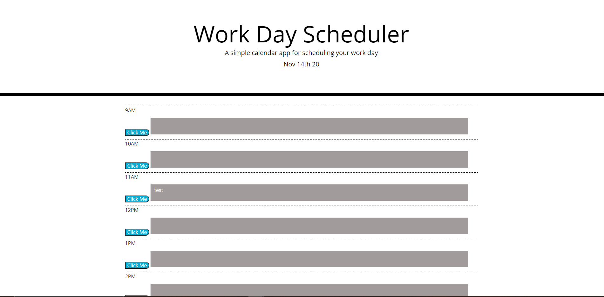

# HW-5-Daily-Planner

This is a repository for the code to create a basic day planner.

The objective of this project was to create a simple day planner that would track the hours by colorcoating the rows based off of the machines time.

The CSS file was provided as part of the assignment, I tried to stick to more HTML oriented approach with this homework. So all of the displayed elements are created first in HTML then updated with JS. 

## Example screenshot of the deployed app and a link. 
https://thecoaxial.github.io/HW-5-Daily-Planner/

